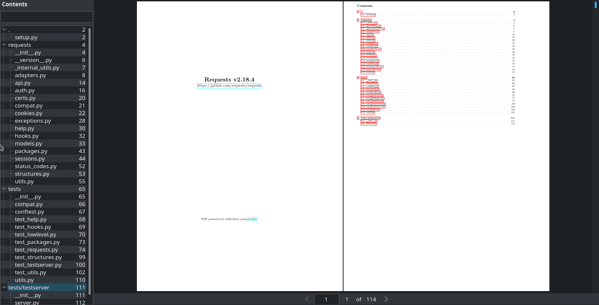

# src2tex

Create beautiful PDFs of source code.

## samples

* [flask](https://github.com/dufferzafar/src2tex/releases/download/v1/flask.pdf)
* [requests](https://github.com/dufferzafar/src2tex/releases/download/v1/requests.pdf)
* [pandas](https://github.com/dufferzafar/src2tex/releases/download/v1/pandas.pdf)
* [scikit-learn](https://github.com/dufferzafar/src2tex/releases/download/v1/scikit-learn.pdf)
* [bitcoin](https://github.com/dufferzafar/src2tex/releases/download/v1/bitcoin.pdf)

## why?

I wanted to read some source code on my iPad. After trying a few plain text editors and source viewing apps and not liking any of them, I decided to experiment with the PDFs.

## how?

Get a .tex file: 

`src2tex /path/to/root/source/folder > project.tex`

Convert to pdf:

_This requires a full LaTeX installation with packages like minted etc. Have a look at the template.tex file for which packages are used._

`latexmk -silent -pdf -shell-escape -pdflatex='pdflatex -interaction=nonstopmode' project.tex`

## todo

* Use more nesting
    - `\chapter`, `\subsubsection` etc.
